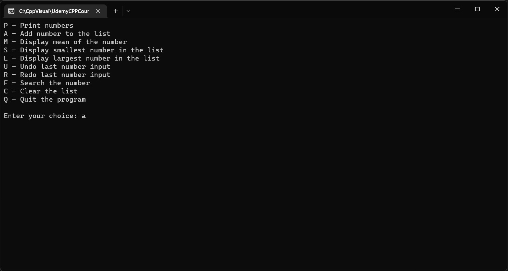
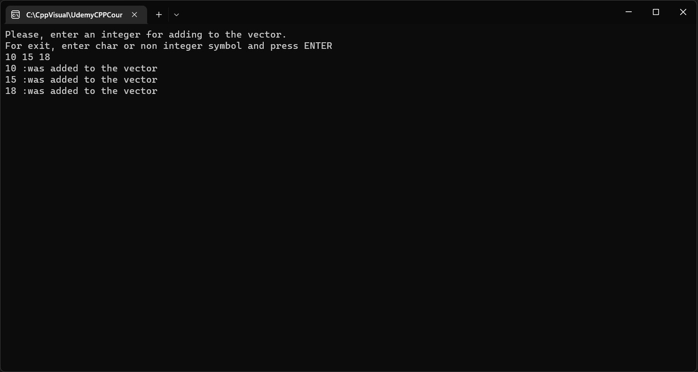
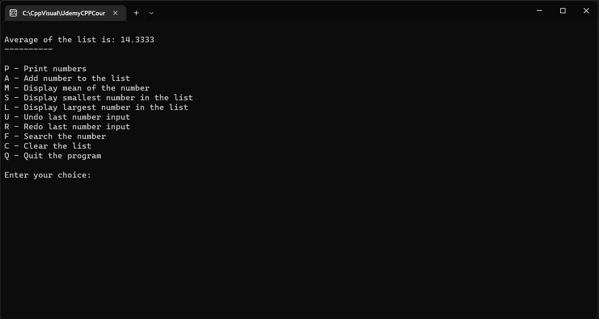
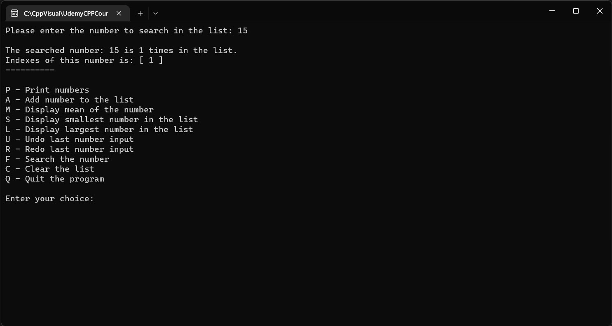

 ## Section 11 Challenge - Program Flow (Reafactoring "Challenge Program Flow". With functions' using).
 
 ***Task text from the author:***
 ```
        Recall the challenge from Section 9 below.
    Your challenge for section 11 is to modularize your solution to the Section 9
    challenge by refactoring your solution so that it uses functions.

    You decide how to modularize the program.
    you can use my solution which is included in this file, or modularize your solution.

    Here are a few hints:
        - Create functions for each major function
        - Keep the functions small
        - Remember the Boss/Worker analogy
        - Keep the vector declaration in the main function and pass the vector object
          to any function that requires it

        DO NOT move the vector object outside main and make it a global variable.

        - You can start by defining a function that displays the menu
        - You can then define a function that reads the selection from the user and returns it in uppercase
        - Create functions for each menu option
        - Create functions that display the list of numbers, calculates the mean and so forth

```
***Screenshots of running program in the console:***









