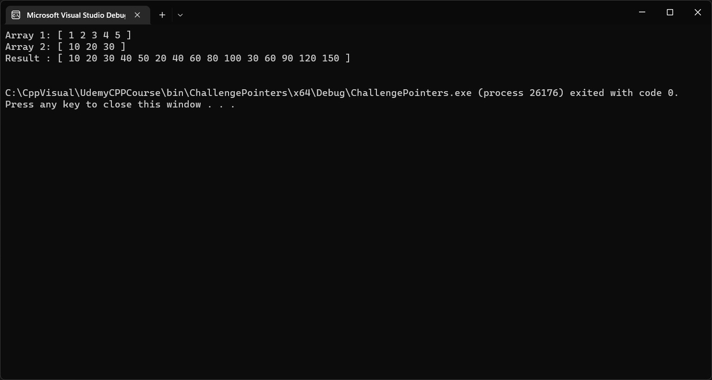

 ## Section 12 Challenge - Pointers.
 
 ***Task text from the author:***
 ```
Write a C++ function named apply_all that expects two arrays of integers and their sizes and
  dynamically allocates a new array of integers whose size is the product of the 2 array sizes

  The function should loop through the second array and multiplies each element across each element of array 1 and store the
  product in the newly created array.

  The function should return a pointer to the newly allocated array.

  You can also write a print function that expects a pointer to an array of integers and its size and display the
  elements in the array.

  For example,

  Below is the output from the following code which would be in main:

    int array1[] {1,2,3,4,5};
    int array2[] {10,20,30};


    cout << "Array 1: " ;
    print(array1,5);

    cout << "Array 2: " ;
    print(array2,3);

    int *results = apply_all(array1, 5, array2, 3);
    cout << "Result: " ;
    print(results,15);

   Output
   ---------------------
   Array 1: [ 1 2 3 4 5 ]
   Array 2: [ 10 20 30 ]
   Result: [ 10 20 30 40 50 20 40 60 80 100 30 60 90 120 150 ]

```
***Screenshots of running program in the console:***

