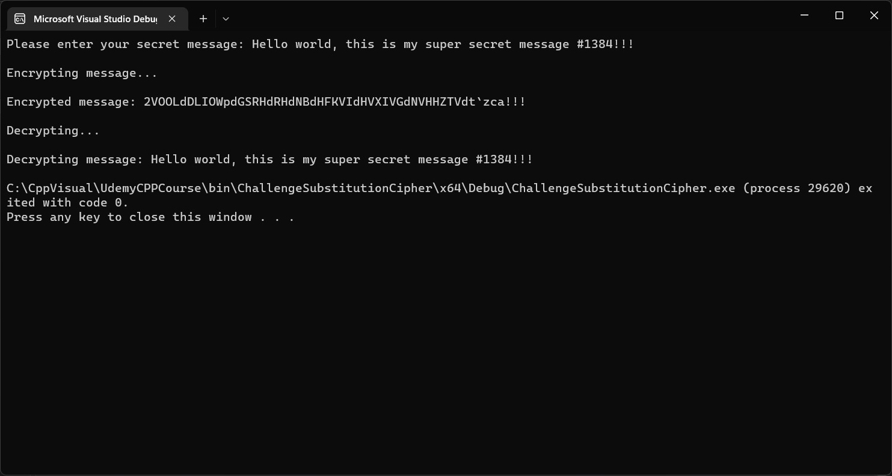

### Section 10 Challenge - Substitution Cipher
```
A simple and very old method of sending secret messages is the substitution cipher.
You might have used this cipher with your friends when you were a kid.
Basically, each letter of the alphabet gets replaced by another letter of the alphabet.
For example, every 'a' get replaced with an 'X', and every 'b' gets replaced with a 'Z', etc.

Write a program thats ask a user to enter a secret message.

Encrypt this message using the substitution cipher and display the encrypted message.
Then decryped the encrypted message back to the original message.

You may use the 2 strings below for  your subsitition.
For example, to encrypt you can replace the character at position n in alphabet
with the character at position n in key.

To decrypt you can replace the character at position n in key
with the character at position n in alphabet.
```

***Screenshots of running program in the console:***


