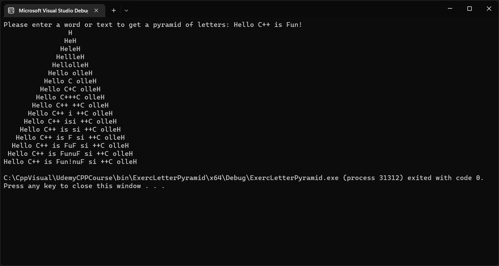
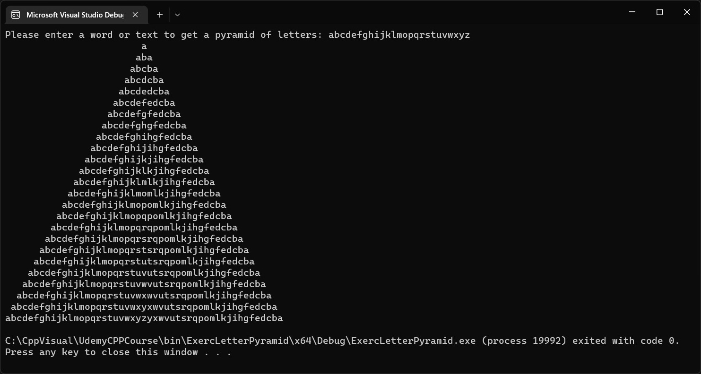

### Exercise - Letter Pyramid
```
Write a C++ program that displays a Letter Pyramid from a user - provided std::string.
Prompt the user to enter a std::string and then from that string display a Letter Pyramid as follows :
It's much easier to understand the Letter Pyramid given examples.
If the user enters the string "ABC", then your program should display :

   A
  ABA
 ABCBA

If the user enters the string, "12345", then your program should display :

     1
    121
   12321
  1234321
 123454321

If the user enters 'ABCDEFG', then your program should display :

       A
      ABA
     ABCBA
    ABCDCBA
   ABCDEDCBA
  ABCDEFEDCBA
 ABCDEFGFEDCBA
```

***Screenshots of running program in the console:***





